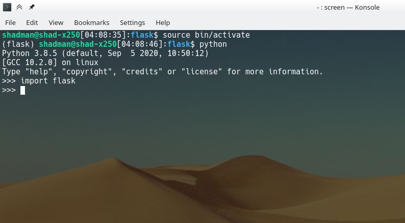
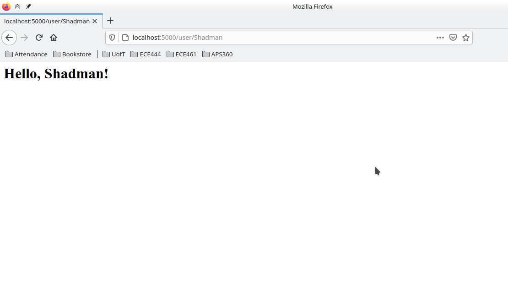

# ECE444-F2020-Lab2

## Shadman Siddiqui
This repo is a clone of https://github.com/miguelgrinberg/flasky

## Activity 1

## Activity 2

## Activity 3
Flask uses two contexts: the application context and the request context. The application context contains the following globals:
* `current_app`: instance of the current flask app
* `g`: object used for temporary storage while handling requests

The request context contains the following globals:
* `request`: object containing HTTP request
* `session`: dictionary of values preserved across requests
